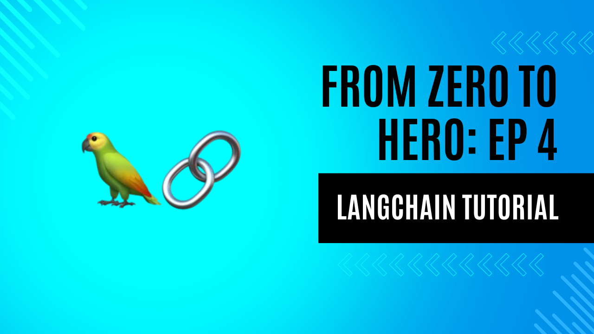

# langchain_chatbot_example
[](https://medium.com/@iamdgarcia/from-zero-to-hero-llms-edition-episode-4-building-a-chatbot-with-langchain-424dbf365602)
[](#)
[](#)
[](#)

## 🚀 About


## 📝 Customise

To customise this project, edit the following files:

- `app/chain.py` contains an example chain, which you can edit to suit your needs.
- `app/server.py` contains a FastAPI app that serves that chain using `langserve`. You can edit this to add more endpoints or customise your server.
- `app/client.py` contains a simple requests client to send messages to the endpoint.
- `tests/test_chain.py` contains tests for the chain. You can edit this to add more tests.
- `pyproject.toml` contains the project metadata, including the project name, version, and dependencies. You can edit this to add more dependencies or customise your project metadata.

## 📚 Install dependencies

If using poetry:

```bash
poetry install
```

If using vanilla pip:

```bash
pip install .
```

## 📃 Usage

By default, this uses OpenAI. So you will need to set your OpenAI API key:

```
export OPENAI_API_KEY="sk-..."
```

To run the project locally, run

```
make server
```

This will launch a webserver on port 8001.
Or via docker compose (does not use hot reload by default):

```
docker compose up
```


## Deploy

To deploy the project, first build the docker image:

```
docker build . -t langchain_chatbot_example:latest
```

Then run the image:

```
docker run -p 8001:8001 -e PORT=8001 langchain_chatbot_example:latest
```

Don't forget to add any needed environment variables!

## Deploy to GCP

You can deploy to GCP Cloud Run using the following command:

First create a `.env.gcp.yaml` file with the contents from `.env.gcp.yaml.example` and fill in the values. Then run:

```
make deploy_gcp
```

## 🤝 Test

You can run a local client using the command
```
make client
```
[]


